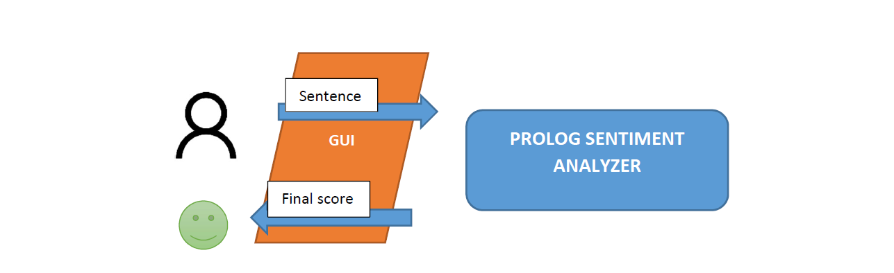
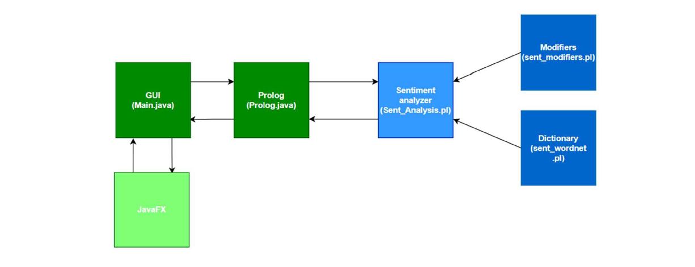
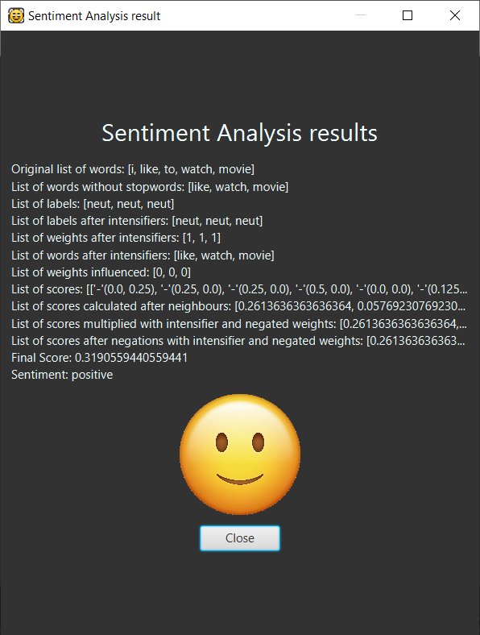
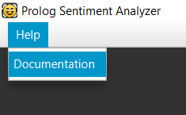
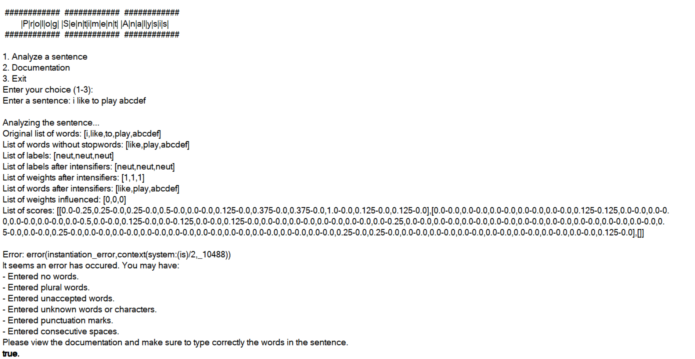
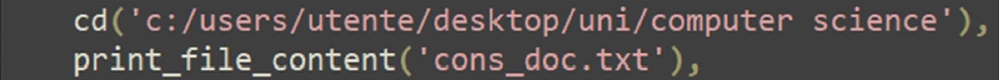
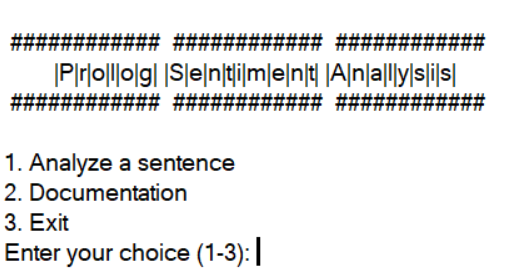
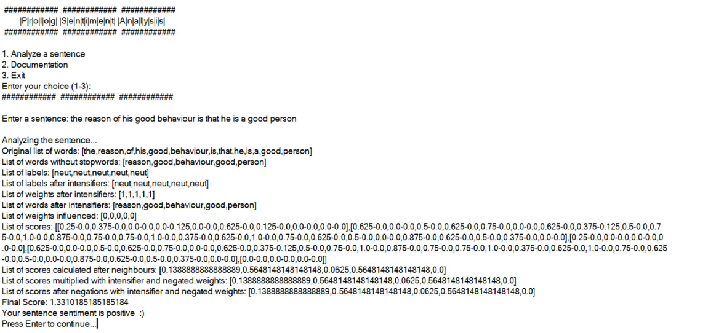
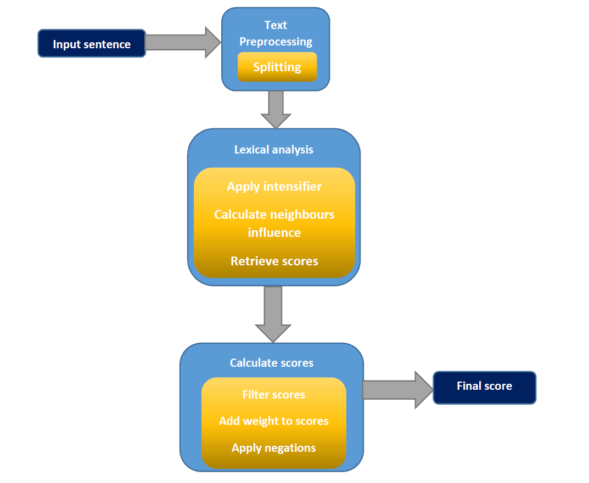

# Prolog Sentiment Analysis

A sentiment analysis system implemented in Prolog, combining Natural Language Processing techniques with the SentiWordNet lexicon to analyze text sentiment.

**Authors:** Federico Chiaradia ([f.chiaradia5@studenti.uniba.it](mailto:f.chiaradia5@studenti.uniba.it)), Yonas Babulet Abetew ([y.babuletabetew@studenti.uniba.it](mailto:y.babuletabetew@studenti.uniba.it))

**Institution:** Department of Computer Science, University of Bari

------

## 📋 Table of Contents

- [Introduction](#introduction)
- [Features](#features)
- [System Architecture](#system-architecture)
- [Prerequisites](#prerequisites)
- [Installation](#installation)
- Usage
  - [GUI Version](#gui-version)
  - [Console Version](#console-version)
- How It Works
  - [Processing Pipeline](#processing-pipeline)
  - [Text Preprocessing](#text-preprocessing)
  - [Lexical Analysis](#lexical-analysis)
  - [Score Calculation](#score-calculation)
- [Project Structure](#project-structure)
- [Examples](#examples)
- [Limitations and Future Improvements](#limitations-and-future-improvements)
- [License](#license)

------

## 🎯 Introduction

Sentiment analysis, also known as opinion mining, is a computational technique that determines the sentiment or emotional tone expressed in text. This project leverages **Prolog**, a logic programming language, to implement a rule-based sentiment analysis system.

The system classifies input text into three categories:

- **Positive** (score > 0.3)
- **Negative** (score < -0.3)
- **Neutral** (otherwise)

The implementation combines NLP techniques with data from the **SentiWordNet lexicon** to compute sentiment scores based on user input sentences.

------

## ✨ Features

- **Dual Interface**: Access via GUI (JavaFX) or console (SWI-Prolog)
- **Rule-Based System**: Uses declarative Prolog rules for linguistic pattern matching
- **SentiWordNet Integration**: Leverages the SentiWordNet v3.0.0 lexicon for sentiment scoring
- **Advanced NLP Pipeline**: Includes stopword removal, intensifier detection, negation handling, and neighbor influence calculation
- **Transparent Processing**: Shows intermediate steps for educational purposes
- **Error Handling**: Provides helpful feedback for invalid inputs

------

## 🏗️ System Architecture

||

|:--:|

|*Figure 1: Graphical schema of usage*|

The system consists of three main modules:

1. **GUI (Main.java)**: JavaFX-based graphical interface for user interaction

2. **Prolog Bridge (Prolog.java)**: Java-Prolog interface using JPL library

3. Sentiment Analyzer (Sent_Analysis.pl)

   : Core Prolog logic with two sub-modules:

   - `sent_modifiers.pl`: Dictionary of indicators, intensifiers, and negations
   - `sent_wordnet.pl`: SentiWordNet lexicon database

|

|

|:--:|

|*Figure 2: Dependency diagram*|

------

## 📦 Prerequisites

- **SWI-Prolog**: Required for running the Prolog engine
- **Java**: Required for the GUI version (JDK 8 or higher recommended)
- **JavaFX SDK**: Included with the launch files for the GUI version

------

## 🚀 Installation

1. Clone this repository:

```bash
git clone https://github.com/yourusername/prolog-sentiment-analysis.git
cd prolog-sentiment-analysis
```

1. Ensure SWI-Prolog is installed on your system
2. For the GUI version, verify that Java is installed:

```bash
java -version
```

------

## 💻 Usage

### GUI Version

1. Navigate to the `GUI` folder
2. Run the batch file:

```bash
PrologSentimentAnalysis.bat
```

1. The JavaFX interface will open

||

|:--:|

|*Figure 3: Menu of the application*|

1. Enter a sentence in the input field and click **Submit**
2. View the analysis results in the modal window

||

|:--:|

|*Figure 6: Acceptable input result*|

**Accessing Documentation:** Click on the "Help" menu in the top-left corner to view usage instructions.


||

|:--:|

|*Figure 4: Documentation path*|

||
|:--:|

|*Figure 5: Documentation*|


**Error Handling:** If invalid input is entered, an error modal will appear with helpful tips.

||

|:--:|

|*Figure 7: Unacceptable input error*|

------

### Console Version

1. Navigate to the `console` folder
2. Open SWI-Prolog and consult the main file:

```prolog
?- consult('Sent_Analysis.pl').
```

Alternatively, directly open the file with SWI-Prolog.

⚠️ **Important:** Before consulting, modify line 40 in `Sent_Analysis.pl` to update the path to `cons_doc.txt`:

||

|:--:|

|*Figure 8: Line of code to modify*|


1. The main menu will launch automatically. To run manually:

```prolog
?- main.
```

||

|:--:|

|*Figure 9: Console menu*|

1. Choose an option:
   - **1**: Analyze a sentence
   - **2**: View documentation
   - **3**: Exit

**Example Usage:**

||

|:--:|

|*Figure 10: Acceptable input*|

||

|:--:|

|*Figure 11: Unacceptable input*|


------

## 🔧 How It Works

### Processing Pipeline

||

|:--:|

|*Pipeline diagram*|

The system processes input text through the following stages:

1. **Input Sentence**
2. Text Preprocessing
   - Splitting
   - Stopword removal
3. Lexical Analysis
   - Apply intensifiers
   - Calculate neighbor influence
   - Retrieve scores from SentiWordNet
4. Calculate Scores
   - Filter scores
   - Add weights
   - Apply negations
5. **Final Score**

------

### Text Preprocessing

#### 1. Splitting Words

The input sentence is tokenized into individual words and stored in a list.

#### 2. Remove Stopwords

Common stopwords (defined in the knowledge base) are removed:

```prolog
stopwords('so').
stopwords('the').
```

#### 3. Assign Labels

Each word is labeled based on its linguistic function:

- **Indicator** (`pos`/`neg`): Words indicating positive or negative sentiment
- **Intensifier** (`in-[score]`): Words that amplify sentiment (e.g., "very", "extremely")
- **Negation** (`n`): Words that negate sentiment (e.g., "not", "never")
- **Neutral** (`neut`): Default label if no match is found

Labels are defined in `sent_modifiers.pl`.

------

### Lexical Analysis

#### 1. Apply Intensifiers

Intensifier scores are merged with adjacent indicators. Non-adjacent intensifiers receive neutral weights.

#### 2. Remove Intensifiers

Intensifier words are removed from the word list while preserving order.

#### 3. Calculate Neighbor Influence

For each word, the system computes influence from neighboring words using their labels. This produces a triple of scores (-1, 0, 1) representing negative, neutral, and positive influence.

#### 4. Retrieve Scores from SentiWordNet

Sentiment scores are retrieved from the **SentiWordNet v3.0.0** lexicon, represented as:

```prolog
synset(a, 0.125, 0.375, ['fearful']).
synset(n, 0.875, 0.0, ['honorableness', 'honorableness']).
```

Where:

- First parameter: Part of speech (a=adjective, n=noun, etc.)
- Second parameter: Positive score
- Third parameter: Negative score
- Fourth parameter: List of synonyms

------

### Score Calculation

#### 1. Calculate Scores

Based on neighbor influence:

- If influence is positive/negative (1 or -1): Use maximum positive/negative score
- If influence is neutral: Use average positive score minus average negative score

#### 2. Add Weights

Multiply each score by its intensifier weight.

#### 3. Apply Negations

Words preceded by negations have their scores multiplied by -1.

#### 4. Compute Final Score

Sum all word scores to get the final sentiment score:

```
negative if score < -0.3
positive if score > 0.3
neutral otherwise
```

------

## 📁 Project Structure

```
prolog-sentiment-analysis/
├── GUI/
│   ├── PrologSentimentAnalysis.bat
│   ├── Main.java
│   ├── Prolog.java
│   ├── jpl.jar
│   └── JavaFX SDK files
├── console/
│   ├── Sent_Analysis.pl
│   ├── sent_modifiers.pl
│   ├── sent_wordnet.pl
│   └── cons_doc.txt
├── Documentation.pdf
└── README.md
```

------

## 📝 Examples

### Good Input Examples:

- "I like to eat apple"
- "he is a very bad person"
- "the reason of his good behaviour is that he is a good person"

### Bad Input Examples:

- "i like to play abcdef" (contains unknown words)
- "we are not happy today" (contains unaccepted words)
- "me and you love to watch a movie" (grammatical issues)

------

## ⚠️ Limitations and Future Improvements

### Current Limitations:

- **String Matching**: Substring matching can cause false positives
- **Case Sensitivity**: All text is converted to lowercase for matching
- **Limited Grammar Rules**: Uses general linguistic patterns rather than comprehensive English grammar
- **Non-exhaustive Dictionary**: Limited coverage in `sent_modifiers.pl`

### Potential Improvements:

- **Stemming/Lemmatization**: Reduce words to root forms for better matching
- **Advanced Intensifier/Negation Handling**: Apply these operations multiple times or to wider contexts
- **Extended Neighbor Analysis**: Consider more neighboring words with additional filters
- **Configurable Thresholds**: Allow users to adjust positivity/negativity score ranges
- **Plural Handling**: Better processing of plural forms
- **Enhanced Grammar Rules**: Incorporate more sophisticated linguistic patterns

------

## 📄 License

This project was developed as part of coursework at the University of Bari, Department of Computer Science.

------

## 🤝 Contributing

This is an academic project. If you have suggestions or improvements, feel free to open an issue or submit a pull request.

------

## 📧 Contact

For questions or feedback:

- Federico Chiaradia: [f.chiaradia5@studenti.uniba.it](mailto:f.chiaradia5@studenti.uniba.it)
- Yonas Babulet Abetew: [y.babuletabetew@studenti.uniba.it](mailto:y.babuletabetew@studenti.uniba.it)

------

**Department of Computer Science**
 **University of Bari**
